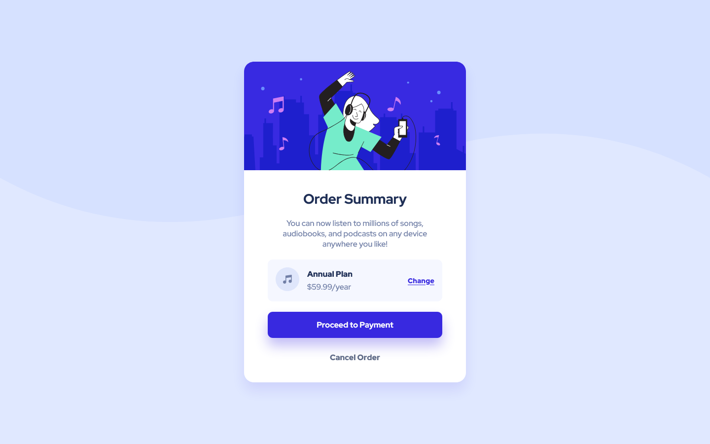

# Frontend Mentor - Order summary card solution

This is a solution to the [Order summary card challenge on Frontend Mentor](https://www.frontendmentor.io/challenges/order-summary-component-QlPmajDUj). Frontend Mentor challenges help you improve your coding skills by building realistic projects. 

## Table of contents

- [Overview](#overview)
  - [The challenge](#the-challenge)
  - [Screenshot](#screenshot)
  - [Links](#links)
- [My process](#my-process)
  - [Built with](#built-with)
- [Author](#author)
- [Acknowledgments](#acknowledgments)

## Overview

### The challenge

Users should be able to:

- See hover states for interactive elements

### Screenshot

### Links

- [Solution URL on Frontend Mentor](https://www.frontendmentor.io/solutions/order-summary-component-using-flexbox-OHxauhfpp)
- [Live Site Solution](https://fm-challenge01.netlify.app/)

## My process

### Built with

- Semantic HTML5 markup
- Flexbox

## Author

- Website - [iamjulian.de](https://www.iamjulian.de/)
- Frontend Mentor - [@juliankruger](https://www.frontendmentor.io/profile/juliankruger)
